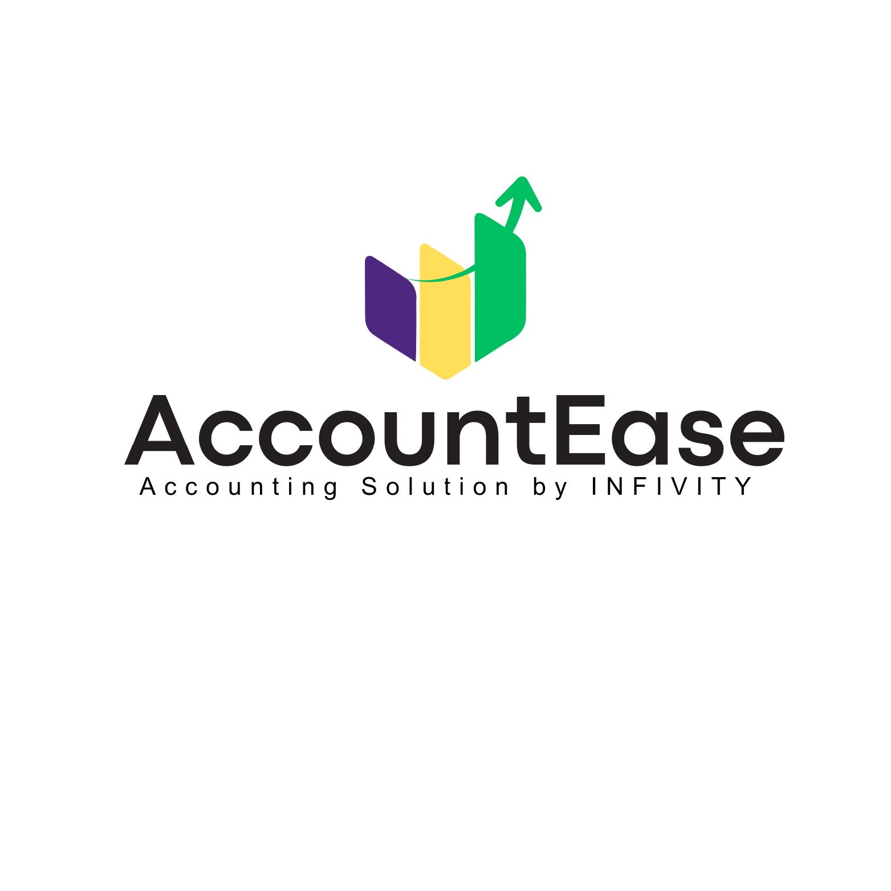

<p align="center"> <a href="https://pathibharaenterprises.com.np/">  </a> </p>

<p align="center"> <strong>AccountEase-Platform</strong><br /> <i>A unified logistics and financial management system engineered for Pathivara Enterprises. AccountEase streamlines shipment tracking and accounting operations through a synchronized web and mobile platform, ensuring seamless oversight of logistics workflows.</i> </p>

<p align="center">    </p>

## Prerequisites

Before you begin, ensure you have the following installed:

-   **Python 3.8+**: [Download Python](https://www.python.org/downloads/)
-   **MySQL Server**: [Download MySQL](https://dev.mysql.com/downloads/installer/) or use XAMPP/WAMP.

## Installation

1.  **Clone the Repository**

    Open your terminal or command prompt and run:

    ```bash
    git clone <repository_url>
    cd AccountEase-Mob-Web/AccountEase
    ```

2.  **Create a Virtual Environment**

    It's recommended to use a virtual environment to manage dependencies.

    ```bash
    python -m venv .venv
    ```

    **Activate the virtual environment:**

    -   **Windows:**
        ```bash
        .\.venv\Scripts\activate
        ```
    -   **macOS/Linux:**
        ```bash
        source .venv/bin/activate
        ```

3.  **Install Dependencies**

    ```bash
    pip install -r requirements.txt
    ```

## Configuration

1.  **Environment Variables**

    Create a file named `.env` inside the `AccountEase` directory (where `manage.py` is located). Add the following configuration, adjusting the values for your local setup:

    ```env
    DEBUG=True
    DJANGO_SECRET_KEY=your_secret_key_here
    ALLOWED_HOSTS=localhost,127.0.0.1
    
    # Database Configuration
    DB_NAME=your_db_name
    DB_USER=your_db_user
    DB_PASSWORD=your_db_password
    DB_HOST=localhost
    DB_PORT=3306
    
    # Email Configuration (Optional)
    EMAIL_HOST_USER=your_email@gmail.com
    EMAIL_HOST_PASSWORD=your_app_password
    ```

2.  **Database Setup**

    -   Ensure your MySQL server is running.
    -   Create a database matching the `DB_NAME` in your `.env` file.
    -   Run migrations to set up the database schema:

    ```bash
    python manage.py migrate
    ```

3.  **Create a Superuser**

    Create an admin account to access the Django admin panel:

    ```bash
    python manage.py createsuperuser
    ```

## Running the Application

Start the development server:

```bash
python manage.py runserver
```

Open your web browser and go to: [http://127.0.0.1:8000/](http://127.0.0.1:8000/)

## Mobile Application

The mobile application is built with Flutter and located in the `frontend/` directory.

### Running the Mobile App

1.  **Navigate to the frontend directory:**
    ```bash
    cd frontend
    ```

2.  **Install Dependencies:**
    ```bash
    flutter pub get
    ```

3.  **Run the App:**
    ```bash
    flutter run
    ```

## Project Structure

-   `accountease/`: Main project configuration settings and URLs.
-   `shipments/`: Core application for handling shipments and logistics.
-   `forgotapp/`: Application handling password reset functionality.
-   `templates/`: Global HTML templates.
-   `static/`: CSS, JavaScript, and image assets.